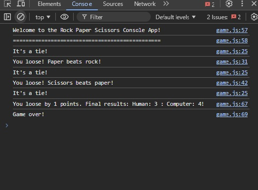

# Rock Paper Scissors Game


This is tha console version of the classical Rock Paper Scissors Game. There are two players, human vs computer, and they both have to choose between rock, paper and scissors. Based on their choice a winner is declared. For now it is played entirely in the console. 

## Table of Contents
- [Installation](#get_started)
- [Technology](#technology)
- [Author](#author)
- [Future Functionalities](#future_functionalities)
- [Support](#support)

## Screenshot


## Live version

For the live version of this project please visit the following [link](https://mesi14.github.io/RPS_Game/)

## Get_started
```bash
    git clon git@github.com:Mesi14/RPS_Game.git
    cd into the folder by typing: cd RPS_Game
    open index.html in the browser
    open the console and start playing the game
```

## Technology

- HTML
- CSS
- JavaScript ES6

## Author :bust_in_silhouette:

- [Mesi](https://github.com/Mesi14)

## Future_Functionalities:

- GUI
- After this addition, the README.md Get started description will be edited

## Support

Give a :star: if you liked the app